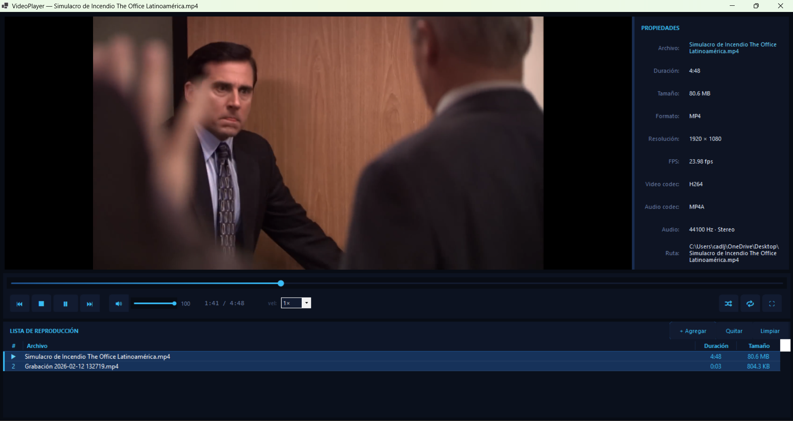
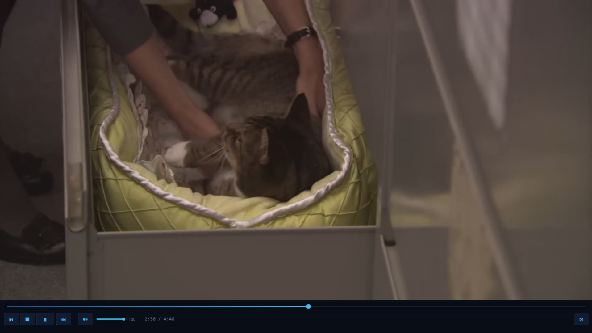

# VideoPlayer — Reproductor de Video (C# WinForms)

Reproductor de video minimalista con diseño **negro + azul** construido sobre **LibVLCSharp**.


---

## Capturas de pantalla

| Ventana principal | Pantalla completa |
|---|---|
|  |  |
| Lista de reproducción, propiedades y controles integrados | Barra de controles con aparición automática al mover el mouse |

---

## Archivos del proyecto

| Archivo | Descripción |
|---|---|
| `Program.cs` | Punto de entrada de la aplicación |
| `Form1.cs` | Lógica principal: reproducción, playlist, teclado, drag & drop |
| `Form1.Designer.cs` | Layout e instanciación de controles (compatible con VS Designer) |
| `Theme.cs` | Paleta de colores y fuentes del tema oscuro |
| `VideoFileInfo.cs` | Modelo de datos con propiedades formateadas del video |
| `FlatButton.cs` | Botón personalizado con estados hover / pressed / toggle |
| `SeekBar.cs` | Barra de progreso seekable con arrastre |
| `VolumeBar.cs` | Control de volumen compacto con soporte rueda del mouse |
| `ThemedListView.cs` | ListView con header y filas pintadas con el tema oscuro |
| `FullscreenForm.cs` | Ventana de pantalla completa con detección de movimiento del cursor |
| `FullscreenOverlay.cs` | Barra de controles flotante (Form TopMost) para el modo fullscreen |
| `VideoPlayer.csproj` | Archivo de proyecto MSBuild |

---

## Requisitos

- **Visual Studio 2022** (o VS Code + .NET 8 SDK)
- **.NET 8 SDK** — target `net8.0-windows`
- Paquetes **NuGet** (se restauran automáticamente):

```
LibVLCSharp              >= 3.9
VideoLAN.LibVLC.Windows  >= 3.0
LibVLCSharp.WinForms     >= 3.9
```

> ⚠️ El proyecto **debe compilarse como x64**.  
> Verificar en: Proyecto → Propiedades → Compilar → Destino de plataforma = `x64`  
> (ya está configurado en el `.csproj`)

---

## Cómo abrir y ejecutar

### Visual Studio 2022   |  Visual Studio 2026 Insiders
1. Copia todos los archivos en una carpeta, por ejemplo `VideoPlayer/`
2. Abre `VideoPlayer.csproj`
3. Clic derecho en la solución → **Restaurar paquetes NuGet**
4. `F5` para compilar y ejecutar

### Línea de comandos
```bash
cd VideoPlayer
dotnet restore
dotnet run
```

---

## Controles de teclado

| Tecla | Acción |
|---|---|
| `Space` | Reproducir / Pausar |
| `←` / `→` | Retroceder / Avanzar 5 s |
| `↑` / `↓` | Subir / Bajar volumen |
| `M` | Silenciar / Reactivar audio |
| `F11` | Entrar / Salir de pantalla completa |
| `Esc` | Salir de pantalla completa |
| `Enter` (en lista) | Reproducir ítem seleccionado |
| `Del` (en lista) | Quitar ítem de la lista |

---

## Funcionalidades

### Reproducción
- ▶ Reproducir / ⏸ Pausar / ■ Detener
- ⏮ Pista anterior · ⏭ Pista siguiente (con wrap-around al final)
- Barra de progreso seekable con arrastre
- Velocidad de reproducción ajustable: `0.25×` `0.5×` `0.75×` `1×` `1.25×` `1.5×` `2×` `3×`
- 🔊 Control de volumen (barra + rueda del mouse) con botón mute
- 🔀 Modo aleatorio · 🔁 Modo repetición

### Lista de reproducción
- Agregar archivos con el botón `+ Agregar` o arrastrando desde el Explorador de Windows
- **Reordenar arrastrando** los ítems dentro de la lista (drag & drop interno con indicador visual de inserción)
- Quitar ítem seleccionado o limpiar lista completa
- Resaltado del ítem en reproducción con barra azul lateral e ícono ▶
- Filas alternas con color ligeramente diferente
- Hover visual al pasar el cursor
- Columnas: `#` · `Archivo` · `Duración` · `Tamaño`

### Panel de propiedades
El panel lateral se actualiza automáticamente al reproducir cada video:

| Campo | Descripción |
|---|---|
| Archivo | Nombre del archivo |
| Duración | Tiempo total formateado |
| Tamaño | Peso del archivo (B / KB / MB / GB) |
| Formato | Extensión del contenedor |
| Resolución | Ancho × Alto en píxeles |
| FPS | Fotogramas por segundo |
| Video codec | Códec de video (FourCC) |
| Audio codec | Códec de audio |
| Audio | Frecuencia de muestreo y canales |
| Ruta | Ruta completa del archivo |

> La duración se obtiene en dos pasos: primero con `media.Parse()` al agregar el archivo a la lista, y luego se actualiza automáticamente desde el evento `LengthChanged` de VLC cuando comienza la reproducción.

### Pantalla completa
- Activar con el botón `⛶`, `F11` o doble clic en el área de video
- **Barra de controles** que aparece al mover el mouse y se oculta a los 3 s de inactividad
- La barra incluye: seek bar, todos los botones de reproducción, volumen y botón de salida
- El cursor también se oculta automáticamente tras 3 s de inactividad
- Detección de movimiento basada en polling de `Cursor.Position` (funciona aunque VLC capture el mouse)
- Salir con `Esc`, `F11` o el botón `⊠` de la barra

### Diseño
- Tema oscuro consistente en toda la interfaz: `#08080C` → `#0E1628` → acento `#38BDF8`
- `ThemedListView` con header completamente personalizado (elimina el cuadrado blanco nativo)
- Controles personalizados: `FlatButton`, `SeekBar`, `VolumeBar`
- Compatible con el **VS Forms Designer** (sin bucles ni lambdas en `InitializeComponent`)

---

## Formatos soportados

`.mp4` · `.avi` · `.mkv` · `.mov` · `.wmv` · `.flv` · `.webm` · `.m4v` · `.ts` · `.mpg` · `.mpeg`

Y cualquier formato adicional que soporte la instalación local de LibVLC.

---

## Notas técnicas

- `Core.Initialize()` debe llamarse antes de crear cualquier instancia de `LibVLC`
- El análisis de metadatos usa `media.Parse()` dentro de `Task.Run` + `ManualResetEventSlim` para esperar a que VLC termine el parse sin bloquear el hilo UI
- Los callbacks de VLC se ejecutan en hilos de background — toda actualización de UI usa `BeginInvoke`
- La ventana de pantalla completa (`FullscreenForm`) y la barra de controles (`FullscreenOverlay`) son Forms independientes con `TopMost = true` para superar la ventana nativa Win32 de LibVLC
- El header nativo del `ListView` (`SysHeader32`) se subclasea con `NativeWindow` interceptando `WM_ERASEBKGND` para eliminar el fondo blanco residual